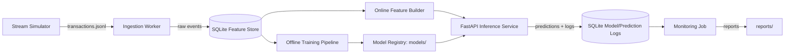

# Real-Time Fraud Detection ML System (End-to-End ML System Design)

A portfolio-grade **ML system design + implementation** project that simulates a real production setup for **real-time transaction fraud detection**.

This repository demonstrates **end-to-end ML engineering**, not just modeling:
- Event generation (stream simulator)
- Feature pipeline (near-real-time aggregates)
- Offline training + evaluation (time-based split)
- Model registry (versioned local artifacts)
- Online inference service (FastAPI)
- Monitoring (drift + performance + alert-ready metrics)
- Reproducible local deployment (Docker Compose) + CI tests

> Dataset: **synthetic but realistic** transactions so the system is fully reproducible and does not depend on external downloads.
> The goal is to showcase system design skills: data contracts, feature freshness, offline/online parity, monitoring, and retraining hooks.

---

## System Architecture



### Key Design Points
- **Offline/Online parity**: the same feature code is used in training and inference.
- **Feature freshness**: features include only data up to (and excluding) the transaction timestamp.
- **Model versioning**: registry stores `model.pkl`, schema, metrics, and a model card.
- **Monitoring**: drift (PSI + KS) + performance (AUC, PR-AUC, calibration) on labeled windows.
- **Retraining-ready**: one command rebuilds the dataset, retrains, and swaps the deployed model.

---

## Quickstart (Local)

### 1) Setup
```bash
python -m venv .venv
source .venv/bin/activate  # Windows: .venv\Scripts\activate
pip install -r requirements.txt
```

### 2) Start the system (API + workers)
```bash
docker compose up --build
```

### 3) Generate streaming traffic
In another terminal:
```bash
python scripts/stream_simulator.py --minutes 5
```

### 4) Query the API
```bash
curl -X POST http://127.0.0.1:8000/predict -H "Content-Type: application/json" -d '{
  "transaction_id": "t_demo_1",
  "ts": "2025-01-01T00:01:00Z",
  "user_id": "u_12",
  "merchant_id": "m_07",
  "amount": 83.4,
  "channel": "web",
  "country": "CA"
}'
```

### 5) Train a new model
```bash
python scripts/train.py
```

### 6) Run monitoring
```bash
python scripts/monitor.py
```

---

## What Makes This “System Design”
This repo includes the pieces hiring managers look for:
- clear **data contracts** (`schemas/transaction.schema.json`)
- **feature store** and freshness controls
- **batch + online** feature computation
- **model registry** with metadata and reproducibility
- **monitoring** and retraining hooks
- deployable **API** with Docker/Compose

---

## Repo Structure
```
.
├── api/                      # FastAPI inference service
├── data/                     # generated events and offline datasets
├── models/                   # local model registry (versioned)
├── reports/                  # monitoring + evaluation reports
├── schemas/                  # data contracts
├── src/fraudsys/
│   ├── config.py
│   ├── db.py                 # sqlite helpers
│   ├── generator.py          # synthetic fraud generator
│   ├── ingestion.py          # ingestion worker
│   ├── features.py           # offline/online feature parity
│   ├── modeling.py           # training + registry
│   ├── monitoring.py         # drift + performance
│   └── utils.py
├── scripts/                  # CLI entrypoints
├── docker-compose.yml
├── Dockerfile
└── tests/
```

---

## License
MIT
